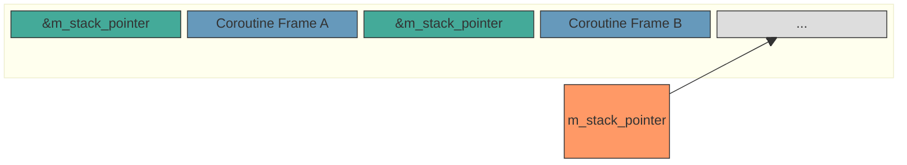
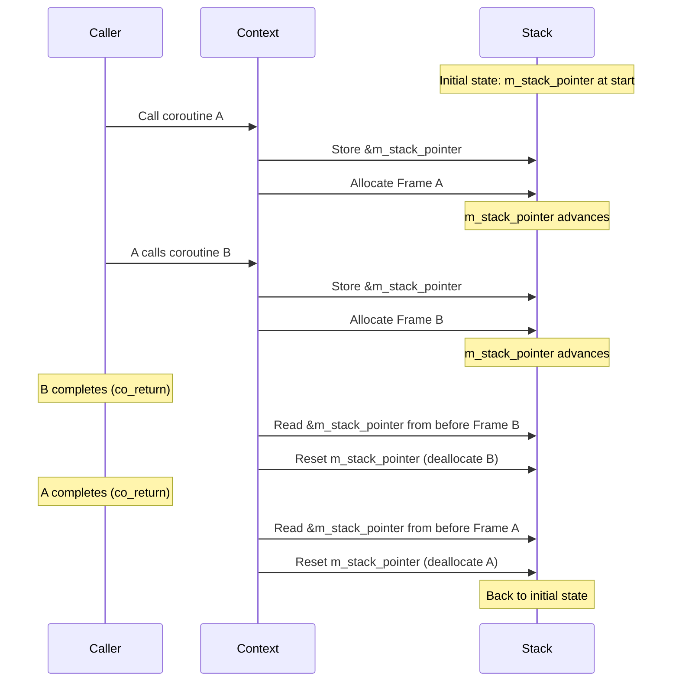

# async_context

A lightweight, C++23 coroutine library for embedded systems and
resource-constrained environments. Built with stack-based allocation to avoid
heap usage and designed to fit within a single cache line for optimal
performance.

## Features

- **Stack-based coroutine allocation** - No heap allocations; coroutine frames are allocated from a user-provided stack buffer
- **Cache-line optimized** - Context object fits within `std::hardware_constructive_interference_size` (typically 64 bytes)
- **Blocking state tracking** - Built-in support for time, I/O, sync, and external blocking states
- **Scheduler integration** - Virtual `do_schedule()` method allows custom scheduler implementations
- **Proxy contexts** - Support for supervised coroutines with timeout capabilities
- **Exception propagation** - Proper exception handling through the coroutine chain
- **Cancellation support** - Clean cancellation with RAII-based resource cleanup

> [!WARNING]
>
> Cancellation support is not implemented yet.

## Requirements

- C++23 compiler with coroutine support
- Tested with Clang 18+

## Stack-Based Allocation

Unlike typical coroutine implementations that allocate frames on the heap,
`async_context` uses a stack-based allocation scheme. Each context owns a
contiguous buffer of memory that grows upward as coroutines are called.

### Memory Layout



### How Allocation Works

1. **Allocation**: When a coroutine is created, the promise's `operator new`
   requests memory from the context. The context:
   - Stores the address of `m_stack_pointer` at the current position
   - Returns the next address as the coroutine frame location
   - Advances `m_stack_pointer` past the allocated frame

2. **Deallocation**: When a coroutine completes, `operator delete`:
   - Reads the stored `&m_stack_pointer` from just before the frame
   - Resets `m_stack_pointer` back to that position

This creates a strict LIFO (stack) discipline—coroutines must complete in
reverse order of their creation, which naturally matches how `co_await` chains
work.

### Allocation Sequence



### Benefits

- **No heap allocation**: Ideal for embedded systems without dynamic memory
- **Deterministic**: Memory usage is bounded by the stack buffer size
- **Cache-friendly**: Coroutine frames are contiguous in memory
- **Fast**: Simple pointer arithmetic instead of malloc/free

## Core Types

### `async::context`

The base context class that manages coroutine execution and memory. Derived classes must:

1. Provide stack memory via `initialize_stack_memory()`, preferably within the
   constructor.
2. Implement `do_schedule()` to handle blocking state notifications

### `async::future<T>`

A coroutine return type containing either a value, asynchronous operation, or
an `std::exception_ptr`. If this object is contains a coroutine handle, then it
the future must be resumed until the future object is converted into the value
of type `T`.

- Synchronous returns (no coroutine frame allocation)
- `co_await` for composing asynchronous operations
- `co_return` for returning values
- Move semantics (non-copyable)

### `async::task`

An alias for `async::future<void>` - an async operation with no return value.

### `async::blocked_by`

An enum describing what a coroutine is blocked by:

- `nothing` - Ready to run
- `io` - Blocked by I/O operation
- `sync` - Blocked by resource contention (mutex, semaphore)
- `external` - Blocked by external coroutine system
- `time` - Blocked until a duration elapses

The state of this can be found from the `async::context::state()`. All states
besides time are safe to resume at any point. If a context has been blocked by
time, then it must defer calling resume until that time has elapsed.

## Usage

### Basic Coroutine

```cpp
import async_context;

async::future<int> compute(async::context& p_ctx) {
    co_return 42;
}
```

### Awaiting Time

```cpp
async::future<void> delay_example(async::context& p_ctx) {
    using namespace std::chrono_literals;
    co_await 100ms;  // Request the scheduler resume this coroutine >= 100ms
    co_return;
}
```

### Awaiting I/O

```cpp
async::future<void> io_example(async::context& p_ctx) {
    dma_controller.on_completion([&ctx]() {
      ctx.unblock();
    });

    // Start DMA transaction...

    while (!dma_complete) {
        co_await ctx.block_by_io();
    }
    co_return;
}
```

Please note that this coroutine has a loop where it continually reports that
its blocked by IO. It is important that any coroutine blocking by IO check if
the IO has completed before proceeding. If not, it must
`co_await ctx.block_by_io();` at some point to give control back to the resumer.

### Composing Coroutines

```cpp
async::future<int> inner(async::context& p_ctx) {
    co_return 10;
}

async::future<int> outer(async::context& p_ctx) {
    int value = co_await inner(p_ctx);
    co_return value * 2;
}
```

### Custom Context Implementation

```cpp
class my_context : public async::context {
public:
    std::array<async::uptr, 1024> m_stack{};

    my_context() {
        initialize_stack_memory(m_stack);
    }

private:
    void do_schedule(async::blocked_by p_state,
                     async::block_info p_info) noexcept override {
        // Notify your scheduler of state changes
    }
};
```

### Using basic_context with sync_wait

```cpp
class simple_context : public async::basic_context {
public:
    std::array<async::uptr, 8192> m_stack{};

    simple_context() {
        initialize_stack_memory(m_stack);
    }
};

simple_context ctx;
auto future = my_coroutine(ctx);
ctx.sync_wait([](async::sleep_duration p_sleep_time) {
    std::this_thread::sleep_for(p_sleep_time);
});
```

### Proxy Context for Timeouts

```cpp
async::future<int> supervised(async::context& p_ctx) {
    auto proxy = async::proxy_context::from(p_ctx);
    auto child_future = child_coroutine(proxy);

    int timeout = 10;
    while (!child_future.done() && timeout-- > 0) {
        child_future.resume();
        co_await std::suspend_always{};
    }

    if (timeout <= 0) {
        throw timed_out();
    }
    co_return child_future.value();
}
```

## Exception Handling

Exceptions thrown in coroutines are propagated through the coroutine chain
until it reaches the top level coroutine. When the top level is reached, the
exception will be thrown from a call to `.resume()`.

```cpp
async::future<void> may_throw(async::context& ctx) {
    throw std::runtime_error("error");
    co_return;
}

async::future<void> just_calls(async::context& ctx) {
    co_await may_throw(ctx);
    co_return;
}

auto future = may_throw(ctx);
try {
    future.resume();
} catch (const std::runtime_error& e) {
    // Handle exception
}
```

## Creating the package

Before getting started, if you haven't used libhal before, follow the
[Getting Started](https://libhal.github.io/latest/getting_started/) guide.

To create the library package call:

```bash
conan create . -pr hal/tc/llvm-20 -pr hal/os/mac --version=<insert-version>
```

Replace `mac` with `linux` or `windows` if that is what you are building on.

This will build and run unit tests, benchmarks, and a test package to confirm
that the package was built correctly.

To run tests on their own:

```bash
./build/Release/async_context_tests
```

To run the benchmarks on their own:

```bash
./build/Release/async_benchmark
```


Within the [`CMakeList.txt`](./CMakeLists.txt), you can disable unit test or benchmarking by setting the following to `OFF`:

```cmake
set(BUILD_UNIT_TESTS OFF)
set(BUILD_BENCHMARKS OFF)
```

## License

Apache License 2.0 - See [LICENSE](LICENSE) for details.

Copyright 2024 - 2025 Khalil Estell and the libhal contributors
